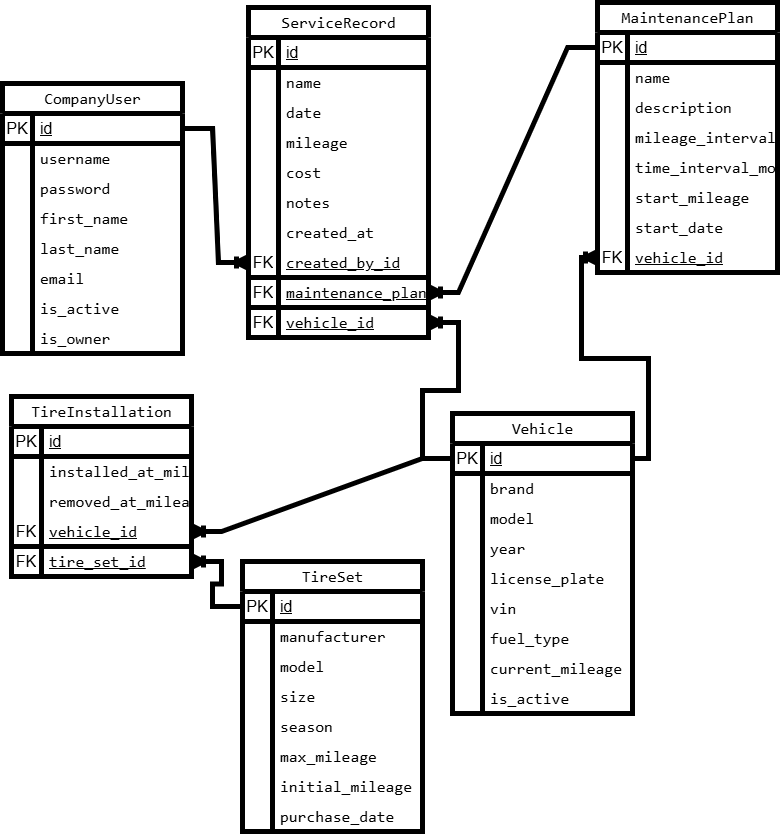

# Fleet Maintenance Manager

Fleet Maintenance Manager is a Django web application designed for managing a company's vehicle fleet and keeping track of vehicle maintenance.

The system allows a company to store its vehicles, monitor their current mileage, create maintenance plans, and keep a history of completed service work. Maintenance plans can be based on mileage, time intervals, or both. The dashboard shows upcoming maintenance and helps identify vehicles that require service.

The application also includes tire management. Tire sets can be registered separately and installed on vehicles. The system keeps the installation and replacement history and calculates the mileage of each tire set based on the distance traveled by the vehicle while the tires were installed.

Service records contain information about completed maintenance, including the vehicle, maintenance plan, date, mileage, cost, notes, and the employee who created the record.

The application has a custom user model with two access levels. The owner can manage company employees, while regular employees can work with the fleet and maintenance data.

Vehicle, maintenance plan, and service history pages support search. Lists with larger amounts of data use pagination.

## Main Features

- Vehicle management and mileage tracking
- Maintenance plans based on mileage and/or time
- Upcoming maintenance reminders
- Service history with costs and notes
- Tire set management and mileage calculation
- Tire installation and replacement history
- Employee management
- Owner and employee access levels
- Authentication
- Search and pagination

## Technologies

The project is built with Python and Django. Django ORM is used to work with the database, and SQLite is used as the database during development.

The user interface is built with Bootstrap 5. Django forms are rendered using django-crispy-forms and crispy-bootstrap5.

Code style is checked with Flake8 and additional Flake8 plugins.

## Database Structure

The project contains six main models:

- CompanyUser
- Vehicle
- MaintenancePlan
- ServiceRecord
- TireSet
- TireInstallation

The database diagram shows the relationships between these models.

The editable draw.io version of the diagram is available at `docs/database-diagram.drawio`.

## Running the Project

Clone the repository:

`git clone https://github.com/BohdanSarai/fleet-maintenance-manager.git`

Go to the project directory:

`cd fleet-maintenance-manager`

Create a virtual environment:

`python -m venv .venv`

Activate the virtual environment and install the dependencies from `requirements.txt`.

Apply database migrations:

`python manage.py migrate`

Run the development server:

`python manage.py runserver`

## Tests and Code Quality

Run the project tests with:

`python manage.py test`

Check the code with Flake8:

`flake8`# Fleet Maintenance Manager

Fleet Maintenance Manager is a Django web application designed for managing a company's vehicle fleet and keeping track of vehicle maintenance.

The system allows a company to store its vehicles, monitor their current mileage, create maintenance plans, and keep a history of completed service work. Maintenance plans can be based on mileage, time intervals, or both. The dashboard shows upcoming maintenance and helps identify vehicles that require service.

The application also includes tire management. Tire sets can be registered separately and installed on vehicles. The system keeps the installation and replacement history and calculates the mileage of each tire set based on the distance traveled by the vehicle while the tires were installed.

Service records contain information about completed maintenance, including the vehicle, maintenance plan, date, mileage, cost, notes, and the employee who created the record.

The application has a custom user model with two access levels. The owner can manage company employees, while regular employees can work with the fleet and maintenance data.

Vehicle, maintenance plan, and service history pages support search. Lists with larger amounts of data use pagination.

## Main Features

- Vehicle management and mileage tracking
- Maintenance plans based on mileage and/or time
- Upcoming maintenance reminders
- Service history with costs and notes
- Tire set management and mileage calculation
- Tire installation and replacement history
- Employee management
- Owner and employee access levels
- Authentication
- Search and pagination

## Technologies

The project is built with Python and Django. Django ORM is used to work with the database, and SQLite is used as the database during development.

The user interface is built with Bootstrap 5. Django forms are rendered using django-crispy-forms and crispy-bootstrap5.

Code style is checked with Flake8 and additional Flake8 plugins.

## Database Structure

The project contains six main models:

- CompanyUser
- Vehicle
- MaintenancePlan
- ServiceRecord
- TireSet
- TireInstallation

The database diagram shows the relationships between these models.

The editable draw.io version of the diagram is available at `docs/database-diagram.drawio`.

## Running the Project

Clone the repository:

`git clone https://github.com/BohdanSarai/fleet-maintenance-manager.git`

Go to the project directory:

`cd fleet-maintenance-manager`

Create a virtual environment:

`python -m venv .venv`

Activate the virtual environment and install the dependencies from `requirements.txt`.

Apply database migrations:

`python manage.py migrate`

Run the development server:

`python manage.py runserver`

## Tests and Code Quality

Run the project tests with:

`python manage.py test`

Check the code with Flake8:

`flake8`